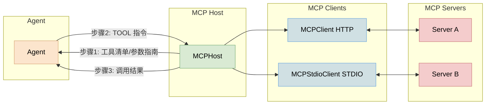

## MCP Host 的价值

- 统一工具供应链：将工具发现、参数指南生成、调用路由与状态管理集中在 Host，避免在不同 Agent 中重复造轮子。
- 降低 Agent 复杂度：Agent 只负责对话与编排，Host 屏蔽 HTTP/STDIO 差异与客户端生命周期，代码更简洁可维护。
- 同/跨进程一致：同时提供 Python API 与 HTTP API，以统一的 `<tool>{...}</tool>` 契约进行调用，便于多端复用。
- 可观测与治理：内置服务器/工具启用开关与备注、健康检查与结构化错误，支持面板管理与灰度控制。
- 快速集成与扩展：三行集成（`list_all_tools`、`build_param_guide`、`call_tool_by_spec`），工具与服务器可按需增减，最小变更影响业务。
- 提升一致性与复用：多 Agent、多前端共享同一工具集与参数指南，减少认知与维护成本。
- 安全与配置：通过环境变量注入敏感信息，配置与状态文件分离，符合安全最佳实践。

## Host 使用指南

配置格式
- 支持 `mcpServers{}` 键值结构作为服务器配置源
- 每项至少包含 `name/type/url|command/args/env/enabled/headers/note` 中的必要字段，具体字段依服务器类型而定（HTTP 或 STDIO）。


## 总体架构
- 角色划分：
  - Agent：读取用户输入，决定是否输出 `<tool>{...}</tool>` 调用；将工具结果回传给大模型生成最终答案。
  - Host：负责工具目录与参数指南的生成、工具状态过滤、执行真实调用并返回结果。
- 传输与协议：
  - Agent 与 Host 通过 Python API（同进程）或 HTTP API（跨进程）通信；工具调用遵循统一的 `<tool>` 文本契约。

## 架构示意



### 环境变量与配置
- `MCP_SERVER_CONFIG_PATH` 指向 MCP 服务器配置文件 `mcp_server_config.json`。
- `MCP_TOOL_STATE_PATH` 指向工具状态文件 `tool_states.json`。
- `LLM_BASE_URL`、`LLM_API_KEY`、`LLM_MODEL` 用于演示代理的 LLM 客户端。

### Python API 快速上手
1. 创建 Host 并加载配置：
```python
from mcp_host import MCPHost

host = MCPHost(prewarm=False)
```
2. 聚合工具注册表与参数指南：
```python
registry = host.list_all_tools()
guide = host.build_param_guide(registry)
print("可用工具：", ", ".join(sorted(registry.keys())))
print(guide)
```
3. 基于 `<tool>` 契约调用工具：
```python
spec = {"name": "get_current_time", "parameters": {"timezone": "Asia/Shanghai"}}
res = host.call_tool_by_spec(spec)
print(res)
```
4. 面向指定服务器直接调用（不经契约）：
```python
res = host.call_tool("time", "get_current_time", timezone="Asia/Shanghai")
print(res)
```

### 与 Agent 集成（同进程）
- 初始化时从 Host 读取注册表与参数指南，将其注入系统提示；当 LLM 生成 `<tool>{...}</tool>` 文本时，解析为 `spec` 并调用 `host.call_tool_by_spec(spec)`。
- 参考示例：`demo_agent_host.py`。

### HTTP API（跨进程）
1. 启动管理服务：
```bash
python host_server.py --host 127.0.0.1 --port 8000
```
2. 发现能力：
- 列表服务器：`GET /api/servers`
- 列表工具：`GET /api/server/{name}/tools`
- 单工具 Schema：`GET /api/server/{name}/tool-schema?name=...`
3. 统一调用端点：
- `POST /api/tool/call`
  - 请求体：`{"name": "<工具名>", "parameters": {..}, "server?": "<服务器名>"}`（`server` 可选）
  - 响应：`{"name": "<工具名>", "server": "<服务器名>", "result": {...}}` 或包含 `error`
  - 示例（PowerShell）：
```powershell
$body = @{ name='get_current_time'; parameters=@{ timezone='Asia/Shanghai' } } | ConvertTo-Json
Invoke-RestMethod -Method POST -Uri http://127.0.0.1:8000/api/tool/call -ContentType 'application/json' -Body $body
```

### 状态管理（启用/备注）
- 服务器启用：`POST /api/server/toggle`（`{"name": "<服务器名>", "enabled": true|false}`）
- 单工具启用：`POST /api/server/{name}/tools/toggle`（`{"tool": "<工具名>", "enabled": true|false}`）
- 工具备注：`POST /api/server/{name}/tools/note`（`{"tool": "<工具名>", "note": "..."}`）
- 备注会在参数指南中该工具项下展示。

### 常见问题
- 中文管道输入可能存在编码问题，建议直接在交互式输入窗口键入或使用英文示例。
- HTTP 服务器默认跳过预热，仅 STDIO 服务器在启动时执行工具列表预热。
- 当工具名不存在或被关闭时，`call_tool_by_spec` 返回结构化错误，便于 Agent 决定重试或引导补参。

### 代码位置参考
- 注册表聚合：`mcp_host.py:205`
- 参数指南生成：`mcp_host.py:242`
- `<tool>` 契约调用：`mcp_host.py:295`
- 管理服务调用端点：`host_server.py:345`


## 示例：最小 Agent 集成
```python
from mcp_host import MCPHost
from openai import OpenAI

host = MCPHost(prewarm=False)
registry = host.list_all_tools()
guide = host.build_param_guide(registry)

client = OpenAI(base_url=..., api_key=...)
user_msg = input("请输入消息: ")
sys_prompt = (
    "你可使用 MCP 工具。只输出 <tool>{...}</tool> 进行调用。\n"
    "可用工具：" + ", ".join(sorted(registry.keys())) + "\n" + guide
)
first = client.chat.completions.create(model=..., messages=[
    {"role": "system", "content": sys_prompt},
    {"role": "user", "content": user_msg},
])
content = first.choices[0].message.content or ""
spec = extract_spec(content)  # 提取 <tool> JSON
if spec:
    res = host.call_tool_by_spec(spec)
    # 注入 <tool_result> 进行二次生成...
else:
    print(content)
```
