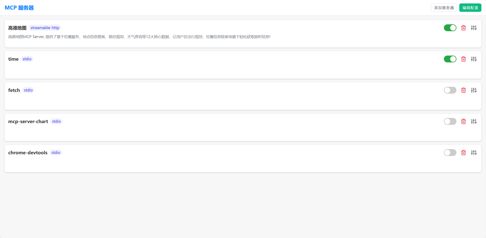
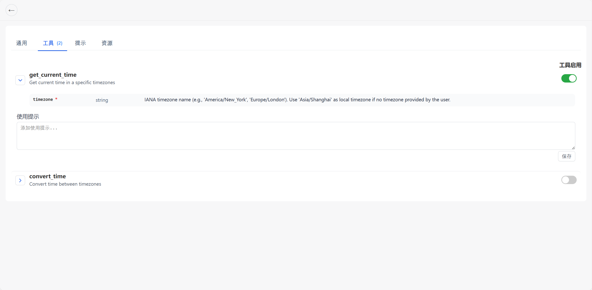
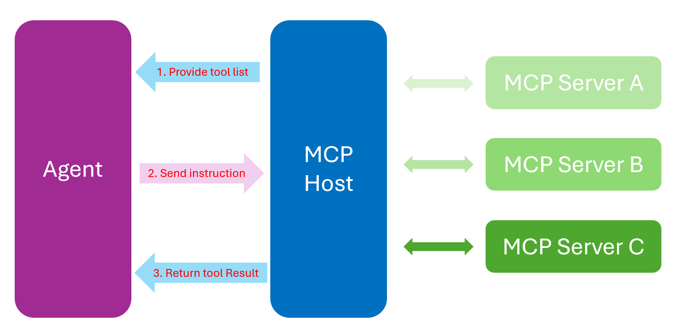

# 🚀 MCP Host

MCP (Model Context Protocol) is an open-source standard for connecting AI applications to external systems. AI Agents need the ability to invoke external tools through LLMs, and MCP has become the de facto standard for this capability. As the ecosystem grows, many products and services ship their own MCP servers. However, integrating MCP in a real agent still requires substantial engineering work and boilerplate.

**MCP Host** takes care of all MCP-related work and is ready to use out of the box. Developers can focus on business logic without worrying about the details of MCP integration.

## 🎯 Features

- Visual dashboard to manage MCP server configurations: view/add/edit/enable/disable servers and tools, manage notes and per-tool toggles
- Simplified agent development: MCP Host selects the server and performs real tool calls; you don’t need to handle MCP wiring

<div align="center">
  
  <p>MCP management page: server list, enable/disable switch, delete button, and settings entry.</p>
  
</div>

<div align="center">
  
  <p>Tools page: shows tools of the selected server with parameter descriptions; supports per-tool enable/disable and saving notes.</p>
  
</div>

<div align="center">
  
  <p>Project architecture</p>
  
</div>

## ✈️ Manage MCP Servers and Tools

- Start management service and frontend: `python host_server.py`
- Open homepage: `http://127.0.0.1:8000/` to view all configured MCP servers
- Configuration file path: `config/mcp_server_config.json`

**Custom Host and Port**

- Default address and port: `127.0.0.1:8000`
- CLI arguments:
  - Set port: `python host_server.py --port 9000`
  - Set host and port: `python host_server.py --host 0.0.0.0 --port 9000`
- Environment variables (used as defaults):
  - `MCP_HOST_ADDR` for bind address (default `127.0.0.1`)
  - `MCP_HOST_PORT` or `PORT` for port (default `8000`)
- Priority: CLI args > Environment variables > Defaults

## ✨ Build Agents Faster with MCP Host
You can easily call MCP tools via MCP Host:
```python
from mcp_host import MCPHost  # Import MCP Host

host = MCPHost()  # 0. Initialize the Host (tool aggregator and router)

tools = host.list_all_tools()  # 1. Read tool registry from enabled servers
guide = host.tools_guide(tools)  # 2. Generate parameter guide for LLMs
has_tool, spec = host.detect_tool(content)  # 3. Parse <tool> JSON from model output
tool_result = host.call_tool(spec, formated=True)  # 4. Execute tool call and return formatted result
```

- `list_all_tools`: Read all available tools from enabled servers to build a registry for prompting and later invocation.
- `tools_guide`: Extract parameter descriptions from JSON Schema and generate a human-readable guide to help the model fill arguments.
- `detect_tool`: Extract `<tool>` instruction JSON from model output; if present, enter the invocation chain; otherwise reply directly.
- `call_tool`: Locate the server by tool name automatically and execute; returns formatted `{name, server, result}` JSON to inject as `<tool_result>...</tool_result>` for the next turn.

Example:

```python
import os
import json
from dotenv import load_dotenv
from openai import OpenAI
from mcp_host import MCPHost  # Import MCP Host

load_dotenv(override=False)

client = OpenAI(base_url=os.getenv("LLM_BASE_URL"), api_key=os.getenv("LLM_API_KEY"))
model = os.getenv("LLM_MODEL")

host = MCPHost()  # 0. Initialize the Host
tools = host.list_all_tools()  # 1. Build tool registry
guide = host.tools_guide(tools)  # 2. Build parameter guide

user_msg = input("Enter your message: ").strip()
sys_prompt = (
    "You are an AI assistant. You can use MCP tools. If you need to call a tool, "
    "output ONLY the following format: <tool>{\n\t\"type\": \"function\",\n\t\"name\": \"<tool-name>\",\n\t\"parameters\": {…}\n}</tool>."
    "Here are the usage notes for each tool:\n" + guide
)

first = client.chat.completions.create(
    model=model,
    messages=[
        {"role": "system", "content": sys_prompt},
        {"role": "user", "content": user_msg},
    ],
)
content = first.choices[0].message.content or ""

has_tool, spec = host.detect_tool(content)
if has_tool:
    tool_result = host.call_tool(spec, formated=True)
    second = client.chat.completions.create(
        model=model,
        messages=[
            {"role": "system", "content": sys_prompt},
            {"role": "user", "content": user_msg},
            {"role": "assistant", "content": content},
            {"role": "system", "content": "<tool_result>" + tool_result + "</tool_result> Please reply to the user in English based on the tool result."},
        ],
    )
    print(second.choices[0].message.content or "")
else:
    print(content)
```

## 🤖 Model Compatibility

- Supports any model and provider compatible with the OpenAI SDK: set `LLM_BASE_URL`, `LLM_API_KEY`, and `LLM_MODEL` to the vendor gateway and model.
- Example: Ark platform `LLM_BASE_URL=https://ark.cn-beijing.volces.com/api/v3`; other OpenAI-compatible gateways can be used.

## 🛠️ Environment and Dependencies

- Install dependencies: `pip install -r requirements.txt`
- Python: `>=3.10`
  - Verify: `python --version`
- Node.js: `>=18`
  - Project root includes `.nvmrc` (value `18`), use nvm/nvm-windows to run `nvm use 18`
  - Ensure `npm/npx` are in `PATH`
  - Verify: `node -v`, `npm -v`, `npx --version`
- uv/uvx (optional, for some stdio servers)
  - Verify: `uvx --version`
- Docker (for the `github` server entry)
  - Current config runs `docker run -i --rm -e GITHUB_PERSONAL_ACCESS_TOKEN mcp/github`; requires Docker installed and available locally
  - Verify: `docker --version`

## 🧪 Demo

- `demo_agent.py`: single tool invocation
- `demo_agent_multi.py`: multi-turn tool invocation for continuous dialogue (note: context resets after each new user input; the agent does not remember previous dialogue)

Preparation:
- Start management service: `python host_server.py` (or specify port: `python host_server.py --port 9000`)
- Ensure at least one enabled server in `config/mcp_server_config.json`
- Set model environment variables: `LLM_BASE_URL`, `LLM_API_KEY`, `LLM_MODEL`

Run examples:
- Single call chain: `python demo_agent.py`
- Multi-step interaction: `python demo_agent_multi.py`

